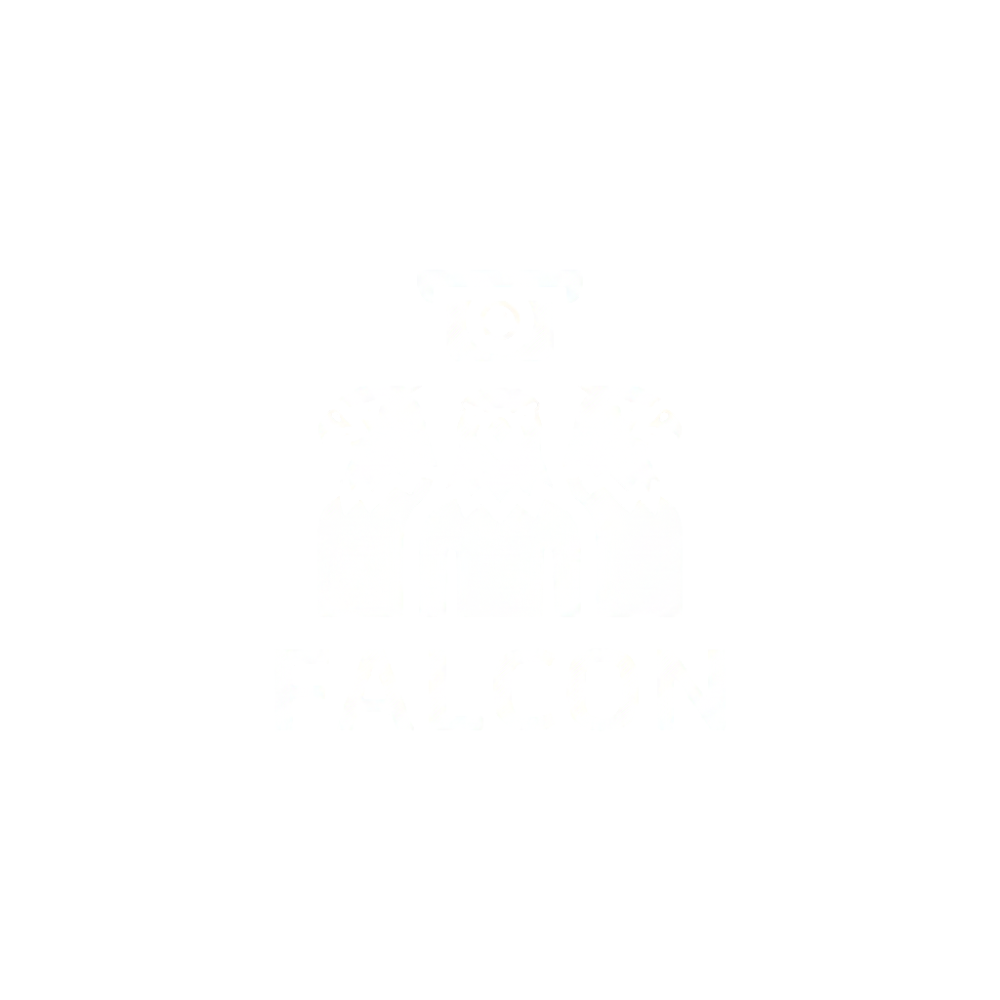
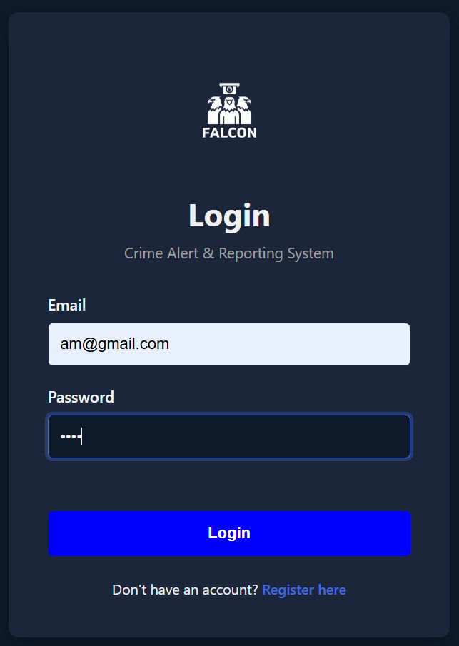
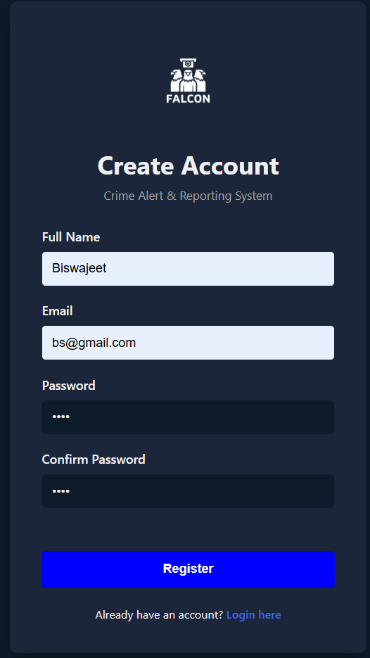
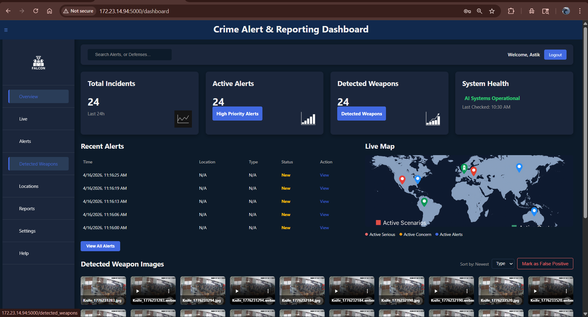
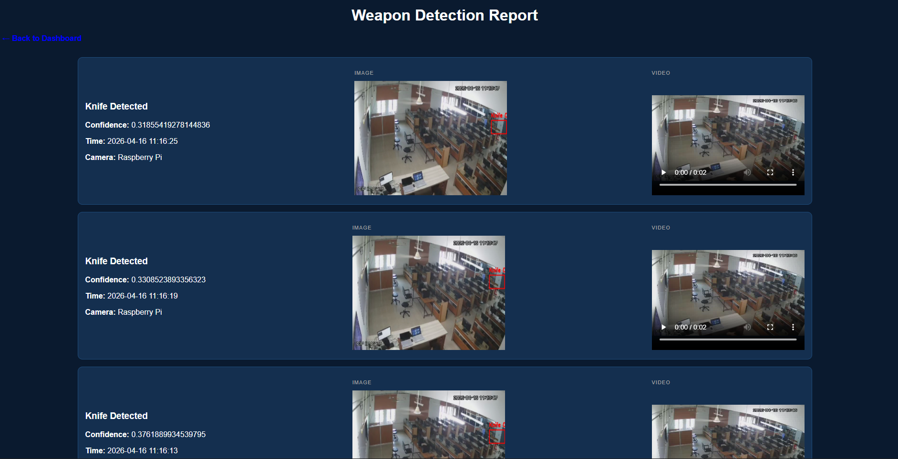
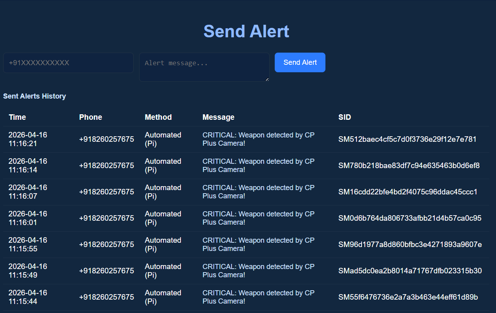

<p align="center">
  
</p>

<h1 align="center">🦅 FALCON</h1>

<h3 align="center">
Automatic Crime Alert and Reporting System
</h3>

<p align="center">
Real-Time Weapon Detection using YOLOv8 • Flask • OpenCV • Raspberry Pi • Twilio
</p>

<p align="center">


</p>

---

# 📑 Table of Contents

- Overview
- Problem Statement
- Solution
- Features
- System Architecture
- Technology Stack
- Project Structure
- Screenshots
- Installation
- Configuration
- Running the Project
- Workflow
- Model Performance
- Security
- Limitations
- Future Roadmap
- Contributing
- License
- Author

---

# 📖 Overview

FALCON is an AI-powered surveillance and emergency response platform that performs **real-time weapon detection** using a custom-trained YOLOv8 model. The system automatically identifies potential threats from live video streams, stores incident data, captures evidence, updates an interactive dashboard, and immediately notifies authorities through Twilio SMS alerts.

Designed as an end-to-end solution, FALCON combines computer vision, backend engineering, edge AI, and web technologies into a complete security platform suitable for educational demonstrations, research, and smart surveillance prototypes.

---

# ❗ Problem Statement

Traditional CCTV systems continuously record video but rely on human operators to identify threats, often delaying emergency response.

FALCON addresses this challenge by automatically detecting weapons in live video streams and triggering immediate alerts while maintaining searchable incident records.

---

# 💡 Solution

The system continuously monitors live video feeds using YOLOv8.

When a weapon is detected:

- Detects the object
- Captures an image
- Records the video clip
- Stores incident details
- Sends SMS alerts
- Updates the dashboard
- Generates detection reports

---

# ✨ Features

## 🤖 AI Detection

- Real-time weapon detection
- Custom YOLOv8 model
- Live RTSP/IP Camera support
- USB Camera support
- Confidence-based detection

## 🚨 Alert System

- Twilio SMS alerts
- Detection history
- Alert logs
- Timestamp recording

## 📊 Dashboard

- Incident analytics
- Active alerts
- Detection statistics
- Weapon gallery
- Interactive reports

## 👤 Authentication

- User Registration
- Secure Login
- Session Management

## 📁 Reports

- Detection reports
- Captured Images
- Video Evidence
- Historical records

## 🖥 Edge AI

- Raspberry Pi compatible
- Lightweight deployment
- Local inference support

---

# 🏗 System Architecture

```
             Live Camera
                  │
                  ▼
          YOLOv8 Detection
                  │
        ┌─────────┴──────────┐
        ▼                    ▼
 Save Image & Video     Twilio SMS Alert
        │                    │
        ▼                    ▼
    SQLite Database      Emergency Contact
              │
              ▼
      Flask Web Dashboard
              │
              ▼
     Reports & Analytics
```

---

# 🛠 Technology Stack

| Layer | Technology |
|---------|------------|
| Programming | Python |
| Backend | Flask |
| Frontend | HTML CSS JavaScript |
| Computer Vision | OpenCV |
| AI Model | YOLOv8 |
| Database | SQLite |
| Alerts | Twilio API |
| Deployment | Raspberry Pi |
| Version Control | Git & GitHub |

---

# 📂 Project Structure

```
FALCON/
│
├── screenshots/
├── static/
├── templates/
├── train_detect_weapons/
│
├── app.py
├── yolo_detect.py
├── live_rtsp_detector.py
├── train_yolo.py
├── twilio_alert.py
├── database.py
├── alert_db.py
│
├── requirements.txt
├── .gitignore
└── README.md
```

---

## Screenshots

### Login


### Register


### Dashboard


### Detection Report


### Alert


---

# ⚙ Installation

```bash
git clone https://github.com/Astik97/FALCON.git

cd FALCON
```

Create virtual environment

```bash
python -m venv venv
```

Windows

```bash
venv\Scripts\activate
```

Linux

```bash
source venv/bin/activate
```

Install dependencies

```bash
pip install -r requirements.txt
```

---

# 🔐 Environment Variables

Create a `.env` file.

```env
TWILIO_ACCOUNT_SID=

TWILIO_AUTH_TOKEN=

TWILIO_PHONE=

SECRET_KEY=
```

---

# ▶ Running the Project

```bash
python app.py
```

Open

```
http://127.0.0.1:5000
```

---

# 🔄 Workflow

```
Start Camera

↓

YOLOv8 Detection

↓

Weapon Detected

↓

Capture Evidence

↓

Store in Database

↓

SMS Alert

↓

Dashboard Update

↓

Generate Report
```

---

# 📈 Model Performance

| Metric | Value |
|---------|--------|
| Model | YOLOv8 |
| Dataset | 9,633 Images |
| Epochs | 50 |
| Precision | 85% |
| Recall | 75% |
| mAP@0.5 | 81% |

---

# ⚡ Performance Benchmark

| Device | FPS | Latency |
|----------|------|----------|
| GPU | 15–25 | 40–60 ms |
| CPU | 5–10 | 120–200 ms |
| Raspberry Pi | 1–3 | 400–800 ms |

---

# 🔒 Security

- Environment variables for secrets
- `.gitignore` excludes credentials
- Secure authentication
- Session management
- No API keys committed

---

# ⚠ Limitations

- Reduced accuracy in poor lighting
- False positives possible
- Raspberry Pi has limited inference speed
- Stable network required for RTSP

---

# 🗺 Future Roadmap

- Docker Support
- PostgreSQL Migration
- Multi-camera Monitoring
- Email Alerts
- Push Notifications
- Cloud Deployment
- ONNX/TensorRT Optimization
- Mobile Dashboard
- Face Recognition Module

---

# 🤝 Contributing

Contributions, issues, and feature requests are welcome.

Fork the repository.

Create a feature branch.

Commit your changes.

Open a Pull Request.

---

# 📄 License

This project is licensed under the MIT License.

---

# 👨‍💻 Author

## Astik Mohapatra

Backend Developer • AI Systems Developer • Computer Vision Enthusiast

📧 Email:
astikm7007@gmail.com

🔗 LinkedIn

https://linkedin.com/in/astik-mohapatra

🐙 GitHub

https://github.com/Astik97

---

# ⭐ Support

If you found this project helpful,

⭐ Star the repository

🍴 Fork it

📢 Share it

Happy Coding 🚀